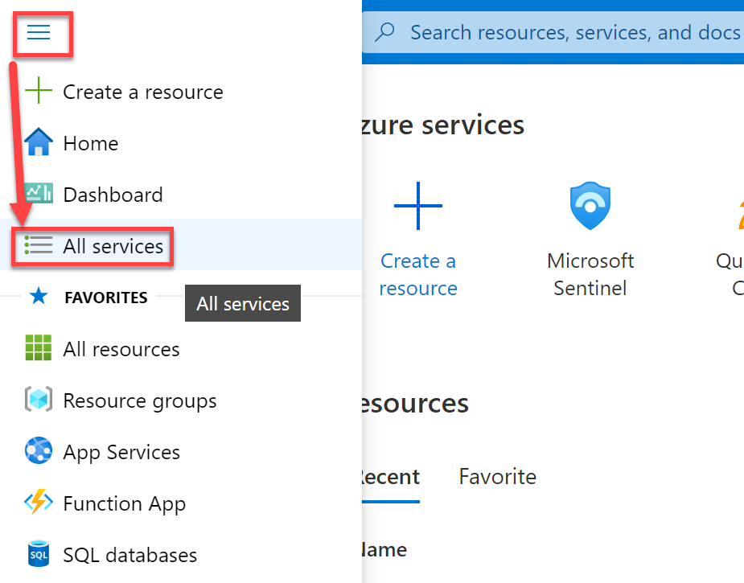
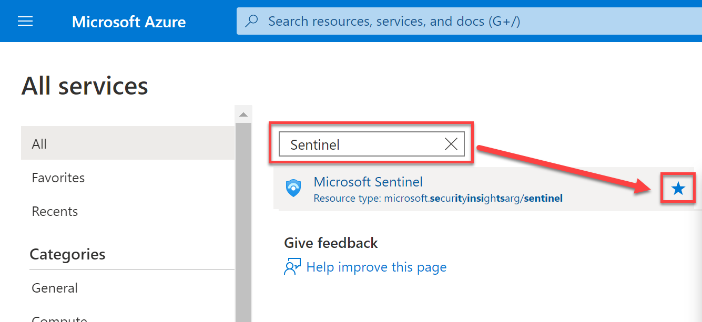
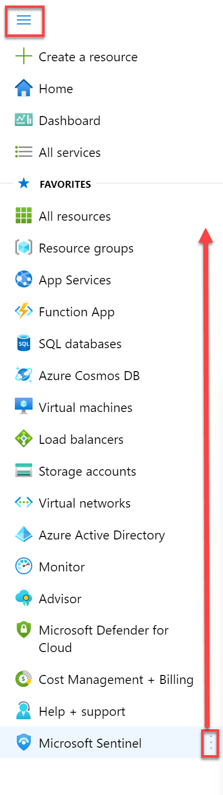

# Lab Setup

#### Objectives

After completing this lab, you will be able to:

 - Successfully login and navigate to Microsoft Sentinel 

#### Scenario

In this technical workshop, attendees will analyze log data from a pre-populated Sentinel workspace. You will need to have a working Azure account, which you will use to sign into an Azure tenant that has at least one Sentinel workspace. 

The Sentinel workspace(s) that you will be working with should be configured with multiple data sources, preferably including Office 365, Azure Active Directory (AD) Sign-in logs, Azure AD Audit logs, and Windows Security Event logs. All Data connectors should be configured to forward all relevant data to the Sentinel workspace(s) you will be working with. 

#### Lab technology
In this technical workshop, you will not need to access any IaaS or any other machines directly. Instead, you will use your own computer to access your preconfigured Sentinel workspace in Azure.

#### User accounts  
To access Microsoft Sentinel in Azure, you will need to navigate to: https://portal.azure.com 
You will then login with your user credentials (username and password)

**Important Note**: Because data changes rapidly, throughout this lab your results may be slightly different than the examples given throughout this lab guide. The guide is meant to be illustrative; slight differences in data are not a problem.

**Important Note 2**: All exercises in this lab should be completed using an InPrivate (Edge) or Incognito (Chrome) browser session. This will ensure that your Microsoft or other credentials do not interfere.

# Exercise 1: Navigate to Microsoft Sentinel and add as a favourite.
In this exercise, you will be:   
1. Logging into the Microsoft Azure portal   
2. Setting up your environment by making sure you are in the correct tenant and subscription  
3. Adding Microsoft Sentinel as a favourite within the navigation pane  
4. Opening Microsoft Sentinel.  

**Task 1: Log into Azure and Navigate to Sentinel** 
In this task, you will log into the Azure portal and navigate to Sentinel.

1.	In a browser, navigate to https://portal.azure.com.

2.	Enter your user credentials.

3.	This brings you to the Azure Home. Click on the settings icon. From here you should be able to see the directory and subscriptions that are avaliabile for your account. 

> **NOTE:** Setting your default selections here will make it easier to find Microsoft Sentinel in future. 

  

4. Select the Azure Portal menu button in the upper left hand corner of the screen, then click **All services**

  

5. Type **Sentinel** in the **Filter services** search box, then select the star icon by Microsoft Sentinel (So it has a solid fill).

  

6. Now click the Azure Portal menu button again in the upper left hand corner of the screen. You will now see Microsoft Sentinel at the bottom of the menu. You can hover your mouse over the vertical ellipses on the right hand side of Microsoft Sentinel and drag it to your desired location

  

7. Now click **Microsoft Sentinel** from the Azure Portal Navigation Pane.

8.	Click and navigate to the Sentinel Workspace that you will use during this lab.

  

9. Minimise any previous portal blades by pressing the double arrows in the upper right hand corner of the blade on the left

  

### Continue with the next lab
<a href="../LAB01/README.MD" target="_blank">Lab 01: Review and Manage Incident in Microsoft Sentinel</a>
