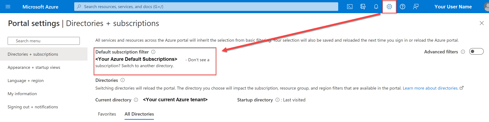
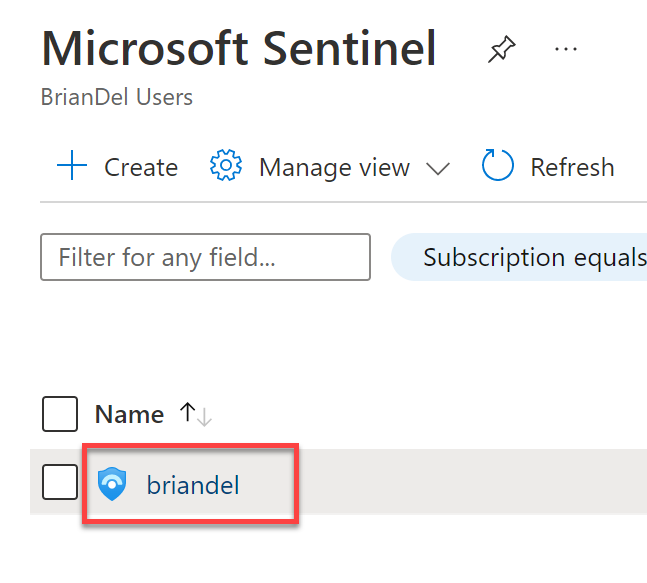

# Lab Setup

#### Objectives

After completing this lab, you will be able to:

 - Successfully login and navigate to Microsoft Sentinel 

#### Scenario

In this technical workshop, attendees will analyze log data from a pre-populated Sentinel workspace. You will not need (and won’t be able to use) your own Azure tenant or subscription. User names and passwords will be provided throughout. Please log on exactly as detailed, including the number that you have been assigned. **Failure to do so will result in potential problems for other lab participants.**

The Sentinel workspace(s) that you will be working with have been configured with multiple data sources, including Office 365, Azure Active Directory (AD) Sign-in logs, Azure AD Audit logs, and Windows Security Event logs. All Data connectors have been configured to forward all relevant data to the sample Sentinel workspace(s) you’ll be working with. Several vulnerabilities have also been configured in these data source environments.

#### Lab technology
In this technical workshop, you will not need to access any IaaS or any other machines directly. Instead, you will use your own computer to access a preconfigured lab in Azure.

#### User accounts  
To access the azure lab, you will navigate to: https://portal.azure.com 
You will then logon with the following account:
Admin**XX**@sentinellab.xyz, where “XX” is the number you have been assigned at the start of class. 
For example, if I was assigned number 47, my username would be user**47**@sentinellab.xyz 
Username: **AdminXX@sentinellab.xyz** 
Password: **Assigned by instructor**

**Important Note**: Because data changes rapidly, throughout this lab your results may be slightly different than the examples given throughout this lab guide. The guide is meant to be illustrative; slight differences in data are not a problem.

**Important Note 2**: All exercises in this lab should be completed using an InPrivate (Edge) or Incognito (Chrome) browser session. This will ensure that your Microsoft or other credentials do not interfere.

# Exercise 1: Navigate to Microsoft Sentinel and add as a favourite.
In this exercise, you will be logging into the Microsoft Azure portal, and setting up your environment by making sure you are in the correct tenant and subscription, adding Microsoft Sentinel as a favourite within the navigation pane and opening Microsoft Sentinel. 

**Task 1: Log on to Azure and Navigate to Sentinel** 
In this task, you will log into the Azure portal and navigate to Sentinel.

1.	In a browser, navigate to https://portal.azure.com.

2.	Enter the account information:
Username: **AdminXX@sentinellab.xyz** (where “XX” is the number you have been assigned at the start of class) 
Password: **Assigned by instructor**

3.	This brings you to the Azure Home. Click on the settings icon. From here you should be able to see the directory and subscriptions that are avaliabile for your account. 

> **NOTE:** There is only one subscription and directory that your account has access to in this demo. Just note that in production environments, you may have access to more. Setting your default selections here will make it easier to find Microsoft Sentinel in future. 

  

3. Select the Azure Portal menu button in the upper left hand corner of the screen, then click **All services**

  

4. Type **Sentinel** in the **Filter services** search box, then select the star icon by Microsoft Sentinel(So it has a solid fill).

  

5. Now click the Azure Portal menu button again in the upper left hand corner of the screen. You will now see Microsoft Sentinel at the bottom of the menu. You can hover your mouse over the vertical ellipses on the right hand side of Microsoft Sentinel and drag it to your desired location

  

6. Now click **Microsoft Sentinel** from the Azure Portal Navigation Pane.

7.	Click **briandel**, which is the name of the Sentinel Workspace.

  

8. Minimise the any previous portal blades by pressing the double arrows in the upper right hand corner of the blade on the left

  

### Continue with the next lab
<a href="../LAB01/README.MD" target="_blank">Lab 01: Review and Manage Incident in Microsoft Sentinel</a>
