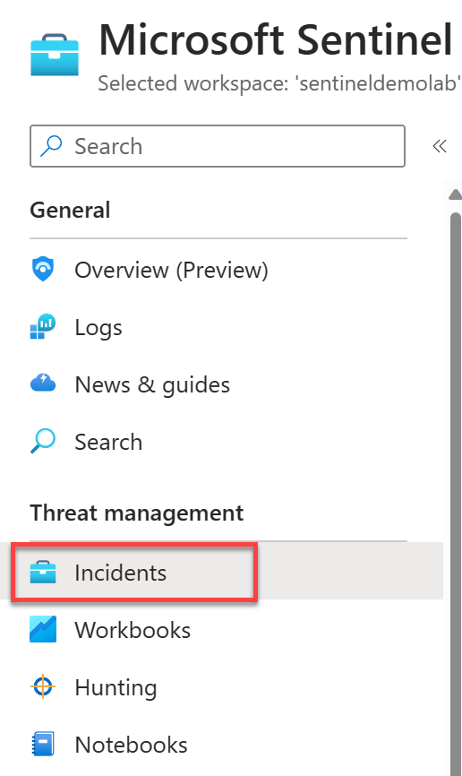
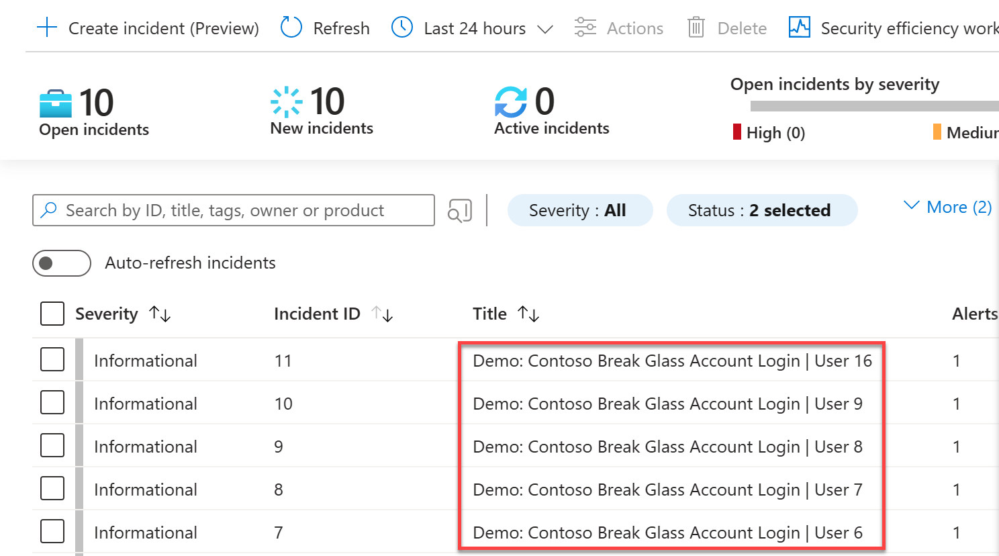
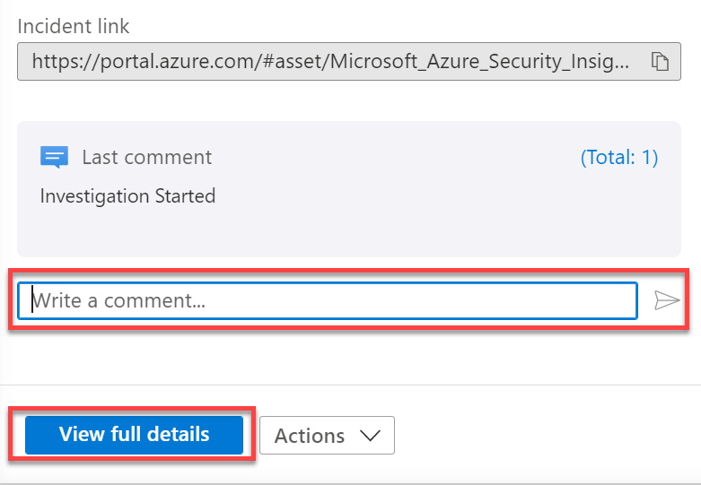
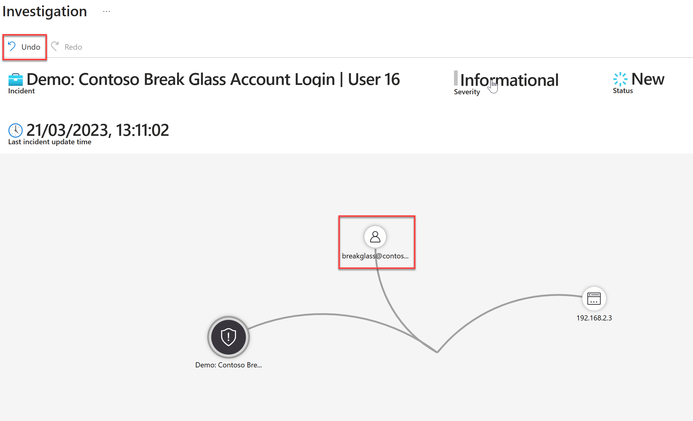

# Lab 01: Review and Manage Incidents in Microsoft Sentinel

As an analyst, your primary goal will be responding to and investigating incidents created within Microsoft Sentinel. In this section we will review an incident that has occurred. You will assign the incident to yourself and go through the details that are provided within the incident, drilling down into the events and investigation. 

## Prerequisites 
Each user should have been assigned a number. There is 1 unique alert produced daily per user, this is to avoid overlap when managing incidents. Ensure you have been assigned a number by the instructor. When this document refers to "*User XX*", XX is the number which you have been assigned.

## Task 1: Review your Incidents 

1. From within the Microsoft Sentinel blade, under Threat management, select **Incidents**.
  

2. Click the toggle switch for **Auto-refresh incidents** to enable it. Change the **Time Range** to the last 48 hours.
  

3. Look through the open incidents in the Sentinel workspace, and locate the incident named "*Demo: Contoso Break Glass Account Login | User XX*", where XX is the number assigned to you.
  

> Note: There should be at least one incident per day. If the incident isn't avaliable, ensure that you don't have any filters set, such as severity. The demo incident should be set to *Informational* by default.

4. Click on your incident, then review the details in the right hand pane.
5. At the top of the detail pane, select **Owner** and change the owner to yourself by selecting your account (Assign to Me), then click **Apply**.
  

6. Change the incident status to Active, by selecting **status**, clicking **Active**, then click **Apply**.
  

7. Scroll down the incident and select the plus **" + "** button under Tags. Enter **Demo Lab**, then click **OK**.
  

8. At the bottom of the incident, add a simple comment in the comment field, such as *"Beginning Investigation"*.
9. Once done, click **View full details**
  

10. When opening full details, the previous details pane can be found on the left. Minimize this by clicking the double left arrows "<<"
  

11. Review the **Incident Timeline**. Depending on when the incident was first created, will depend on how many alerts are shown (1 per day for this Demo alert by default). Select an alert within the Incident Timeline and review the individual details. The timeline also shows other events, including bookmarks. Once done click the **System alert ID**.
  

12. The logs for the alert will appear in a context pane. Press the arrows to the left hand side of the results to expand rows and dynamically typed results.
13. Click **Done** once finished.

> **NOTE:** If a message pops up asking to discard edits, click **Ok**.
  

14. At the bottom of the Incident Overview pane, review **Similar incidents (Preview)**. This pane will show you the top 20 incidents that could be consider similar and the reason why.
  

15. Click **Entities**. Here you should see the aggregated list of entities within the incident, from the alerts and bookmarks. 
  

16. Select each entity and review the tabs "**Info**", "**Timeline**" and "**Insights**". This is data that is populated using "User and Entity Behaviour Analytics". In this demo, not much information will be populated due to the lack of data sources, but you can observe what type of data would be populated and you can hover over any "Info" button to find out more details.
  

17. From the Incident Overview pane, click **Activity Log**. You will see your previously added comment. In this interface, you can add some further text, and format the comments using the text editor toolbar. Add a new comment and click **Comment**.
18. Once done, click **Close**
  

19. From the Incident Overview pane, click **Tasks**. Here you can see tasks that have pre-populated by an Automation rule. You can add more tasks manually by selecting **"+ Add task"**. Once you have completed each task, make sure you come back to this pane and mark it as complete by selecting the radio button.
  

## Task 2: Perform Incident Investigation

1. From within the Microsoft Sentinel blade, under Threat management, select **Incidents**.
  

2. Select the *Owner* filter, and click **Assigned to me**, then click **OK**
  
> **Note:** Depending on the screen resolution / zoom settings, you may need to click the **More** link to view more filters.

3. Locate your open incident from before. ("*Demo: Contoso Break Glass Account Login | User XX*", where XX is the number assigned to you.)
  
> **Note:** If there are no incidents shown, ensure that you have assigned it to you and the incident status is "*New*" or "*Active*"

4. On the Incident details, click **Actions**, then **Investigate**
  

5. Click and hold one of the circles on the screen. Drag it to another location.
6. Click  **Undo** to reset the movement.
    

7. Click the **user entity**. This will open the Info pane for the selected Object. Review the information displayed on the right hand side.
  

8. Click on the tabs "**Timeline**", "**Insights**" and "**Entities**". 
    - **Timeline:** This will show you the timeline for all events that are shown on the current investigation graph
    - **Insights:** This is insights charts from User and Entity Behaviour Analytics.
    - **Entities:** This is an aggregated list of all Entities, alerts and bookmarks on the current investigation graph
    
&emsp;&emsp;

9. Highlight or right-click the **User entity**, click **More** and then review the investigations, such as *Office activity IPs for this account*. It will be highly likely that all except *Related Alerts* will be greyed out, due to no data relating to this demo event, from data sources such as M365 Defender. 
  

10. Select *Related Alerts*. You will see any alerts that relate to the selected entity appear on the investigation. Review the Timeline and interact with these new entities.
> **Note:** If the objects do not fit on the screen, you can zoom in and out, plus fit to screen on the right hand size. Move the objects around by dragging them to best fit the layout for you.
  

15. Once done, click the **X** in the upper right hand corner to return to the Incident Menu.
> **Note:** You can leave the investigation chart and reopen it later in the same state that you left it in.

## Task 3: Review the Incident Workbook

1. From within the Microsoft Sentinel blade, under Threat management, select **Incidents**.
  

2. Locate your open incident from before. ("*Demo: Contoso Break Glass Account Login | User XX*", where XX is the number assigned to you.)
  
> **Note:** If there are no incidents shown, ensure that you have assigned it to you and the incident status is "*New*" or "*Active*"

3. From the incident overview menu on the right-hand side, scroll down and select **Incident Overview**.
  

4. All of the parameters have been pre-populated by selecting the workbook from the incident. Review the data displayed, including any incident activites, such as assigning, adding comments etc.
  
> **Note:** All this data is from within Log Analytics. The workbook just provides a customisable interface to this data.

> **Reminder:** Do not forget to update your tasks! 😀

### Continue with the next lab

<a href="../LAB02/README.MD" target="_blank">LAB 02 - Investigate Activities Visually</a>
