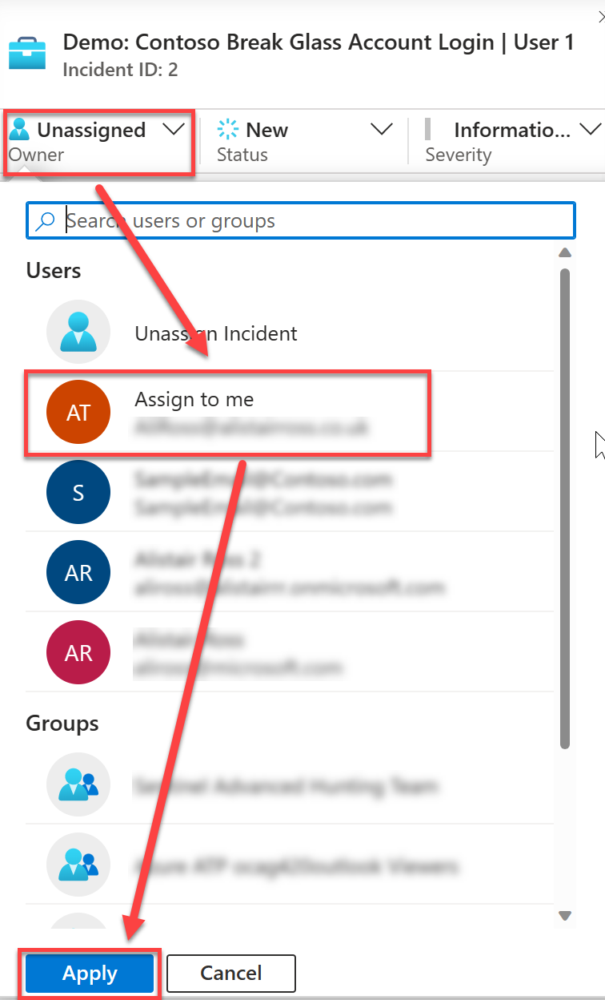
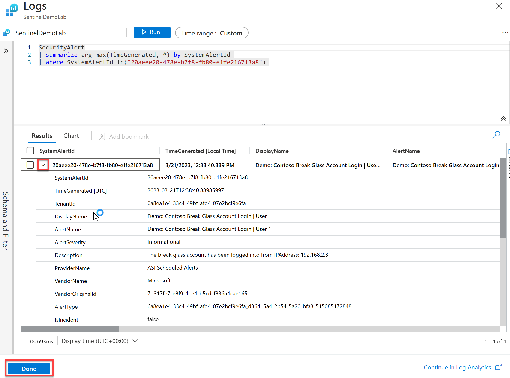

## Lab 01: Review and Manage Incidents in Microsoft Sentinel

As an analyst, your primary goal will be responding to and investigating incidents created within Microsoft Sentinel. In this section we will review an incident that has occurred. You will assign the incident to yourself and go through the details that are provided within the incident, drilling down into the events and investigation. 

#

## Task 1: Review your Incidents

1. From within the Microsoft Sentinel blade, under Threat management, select **Incidents**.

  

2. Look through the open incidents in the Sentinel workspace, and identify an incident that has IP address entity mapping configured   
   

3. Click on your incident, then review the details in the right hand pane.

4. Select **Owner** and change the owner to yourself by selecting your account (Assign to Me), then click **Apply**.

  

5. Change the incident status to Active, by selecting **status**, clicking **Active**, then click **Apply**.

  

6. Scroll down the incident and select the plus **" + "** button under Tags. Enter **Malicious IP**, then click **OK**.

  

7. At the bottom of the incident, add a simple comment in the comment field, such as *"Beginning Investigation"*.

8. Click **View full details**

  

9. Navigate to the incident timeline and review the alert(s) associated with the incident.

10. Click the **System alert ID** for any of the alerts included in the incident. This will take you to the alert details within Logs.   

  

11. Review the data avaliable within the Logs. Press the arrows to the left hand side of the results to expand dynamically typed results.

12. Click the **X** in the upper right hand corner to return to the Incident Timeline. 
> **NOTE:** If a message pops up asking to discard edits, click **Ok**.

  

13. Click **Similar incidents (Preview)**. This tab will show you the top 20 incidents that could be consider similar and the reason why.

  

14. Click **View playbooks**. You can see the playbooks (Logic Apps) that you have permissions to and any runs related to this alert from this window. 

> **NOTE:** You may need to scroll right depending on the resolution / zoom on your screen.

  

  

15. Click the **X** in the upper right hand corner to return to the Incident Alerts.

16. Click **Bookmarks**. This is where you will see bookmarked logs from your investigations within the logs. An example of a bookmark can be seen in the image below.

> **NOTE:** Do not worry if there are no bookmarks. Bookmarks can be created by selecting log results generated from KQL queries, saving the log as a bookmark (bookmarks ae saved in the hunting blade), and manually assigning the bookmark to an incident.

  

19. Click **Entities**. Here you should see the aggregated list of entities within the incident, from Alerts and bookmarks.  

  

20. Click **View entities full details here**. This will take you into the logs and allow you to view further details about the entities from the alerts and bookmarks.

21. Click the **X** in the upper right hand corner to return to the Entities tab.

22. Click the highlighted account entity **standardxx@sentinellab.xyz** (where “XX” is the number you have been assigned at the start of class). 

23. For certain entity types, you can drill down into entity behaviour analytics and get further insights related to the selected entity. Review the data and drill down further into the logs if desired. 
> **Note:** There may not be any anomalies shown due to the few actions performed by this account.

  

24. Click the **X** in the upper right hand corner to return to the Entities.
> **Note:** If you have drilled down into any other views, you may need to press the **X** more than once to navigate back to Entities. Alternatively, navigate back to the incident from the Incident Menu.

25. Click **Comments**. You will see your previously added comment. In this interface, you can add some further text, and format the comments using the text editor toolbar. Once done, click **Comment**.

  

## Task 2: Perform Incident Investigation

1. From within the Microsoft Sentinel blade, under Threat management, select **Incidents**.

  

2. Select the time range at the top and click **Last 48 Hours**.

3. Click the toggle switch for **Auto-refresh incidents** to enable it. 

  

4. Select the *Owner* filter, and click **Assigned to me**
> **Note:** Depending on the screen resolution / zoom settings, you may need to click the **More** link to view more filters.

5. Locate and click on your incident *standard**XX** – Failed Logon* (where “XX” is the number you have been assigned at the start of class).

6. Click **Actions**, then **Investigate**

  

7. Click and hold one of the circles on the screen. Drag it to another location.

8. Click  **Undo** to reset the movement. 

  

9. Click the **user entity** (called standardXX). This will open the Info pane for the selected Object. Review the information displayed on the right hand side.

  

10. Click **Insights**. Review the data from entity and behaviour analytics here.

  

11. Click **Timeline**. This will show you any incidents and bookmarks displayed on screen, in chronological order.

  

12. Click **Entities**. This will display all entities currently displayed on screen.

13. Right-click the **User entity**, click **More** and then click any of the events listed that are not greyed out, such as *Office activity IPs for this account*.

  

14. Repeat step 13 for the other events and other entities. Review the relationships, entities and incidents that appear as you expand the investigation.
> **Note:** If the objects do not fit on the screen, you can zoom in and out, plus fit to screen on the right hand size. Move the objects around by dragging them to best fit the layout for you.

15. Once done, click the **X** in the upper right hand corner to return to the Incident Menu.

## Task 3: Review the Incident Workbook

1. From within the Microsoft Sentinel blade, under Threat management, select **Incidents**.

  

2. Locate and click on your incident *standard**XX** – Failed Logon* (where “XX” is the number you have been assigned at the start of class).

3. From the incident overview menu on the right-hand side, scroll down and select **Incident Overview**.

4. All of the parameters have been pre-populated by selecting the workbook from the incident. Review the data displayed, including any incident activites, such as assigning, adding comments etc. 
> **Note:** All this data is from within Log Analytics. The workbook just provides a friendly customisable interface to this data.

  

### Continue with the next lab

<a href="../LAB02/README.MD" target="_blank">LAB 02 - Investigate Activities Visually</a>
