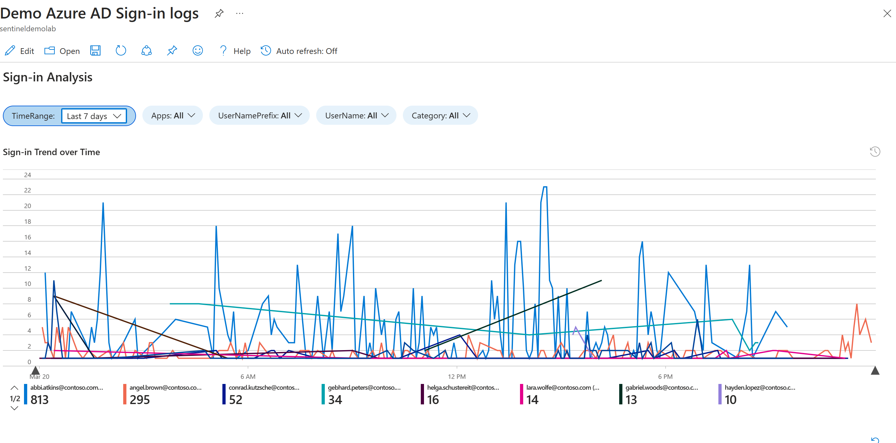

## Lab 01: Review and Manage Incident in Microsoft Sentinel

As an analyst, your primary goal will be responding to and investigating incidents created within Microsoft Sentinel. In this section we will review an incident that has occurred. We will assign the incident to yourself and go through the details that are provided with the incident, drilling down into the events and investigation. 

> **NOTE:** The analytic rules and incidents should be pre-populated by your instructor.
#

## Task 1: Investigate the Azure AD Sign-in Logs

1. From within the Microsoft Sentinel blade, under Threat management, select **Workbooks**.

  

4. Under the *Templates* tab, search for **Azure AD Sign-in logs**. Click the workbook once found.

  

5. A description of the workbook will appear, click **View template**.
> **Note:** Clicking *Save* or *View saved workbook* (Permission dependant) will bring up an editable version of the template, allowing you to create a copy and configure the workbook to meet your requirements.

  

6. Click the drop down parameters to understand what options are presented. Ensure that the following are set:

|Parameter|Value|
|--|--|
|TimeRange| Last 14 days|
|Apps| All|
|UserNamePrefix| All|
|UserName|All|
|Category| SigninLogs|

> **Note:** Notice that the chart *Sign-in Trend over Time* changes when you change the parameters based on your selection. As you select parameters and objects enabled for interactivity, the data below the selected object will most likely change.

  

7. The *Sign-in Trend over Time* chart has been enabled for time brushing. Click and hold on the chart and drag to the left or right to select a point in time on the chart. Observe that the data below has updated.

8. Reset the Time brushing selection. Click the **undo** icon in the upper right hand corner of the chart.

  

9. Click one the activity tiles. Observe that once again the data has changed below, based on your selection. Once done click the *undo* icon in the upper right hand corner.

> **Note:** This icon may appear the far right of the screen. This is because the tiles object has been sized to the full width of the window.

  

10. In the Sign-in by location grid view, click select one of the rows, note the Grid to the right updates. 

11. Within the same grid, expand the location by pressing the arrow to the left of the value in the Name column. Now select a location in the expanded results. Observe that the Location Sign-in details do not return any results. 
> **Note:** The interactivity of the workbooks may not work as you would expect. Take the time when using a workbook to understand how to interact with it and what data it presents. You are empowered to make the changes to a workbook and submit these changes <a href="https://github.com/Azure/Azure-Sentinel/tree/master/Workbooks" target="_blank">here</a>.

  

12. Now drill deeper into the logs by clicking the **Log Analytics icon** on one of the grid views. Here you can see the query and results generated for the selected workbook object.
> **Note:** This may not always be present, it depends on the data source and if the workbook author made it visible.

  

### Continue with the next lab

<a href="../LAB03/README.MD" target="_blank">LAB 03 - Explore Logs using KQL</a>
