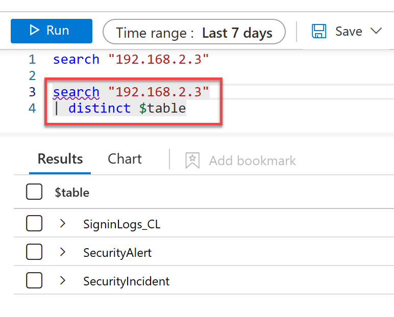
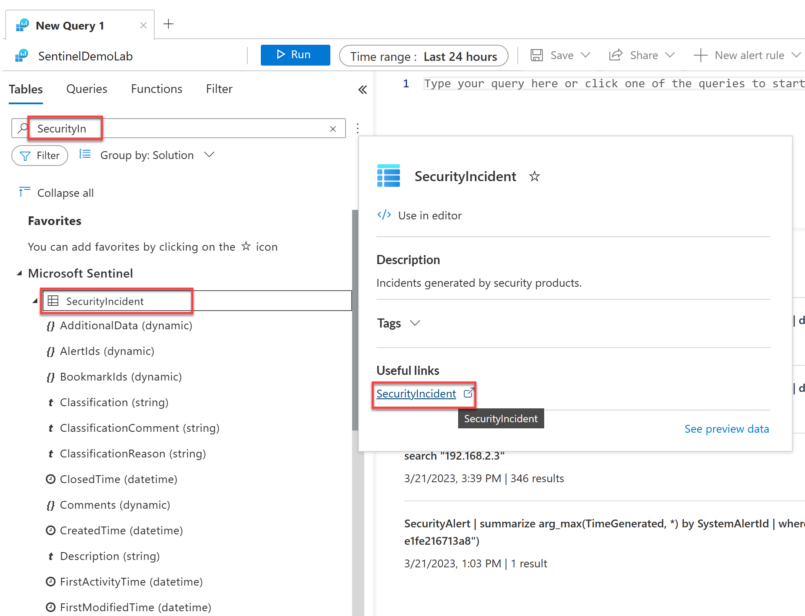
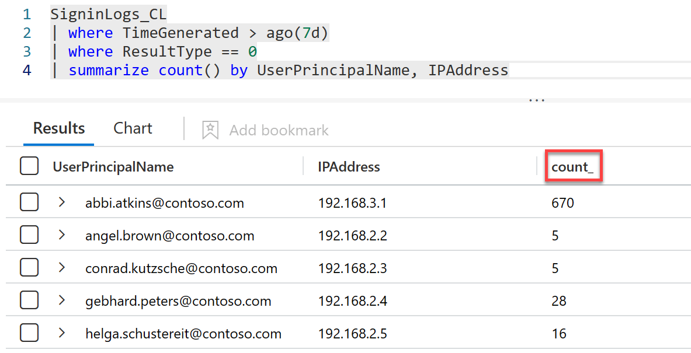
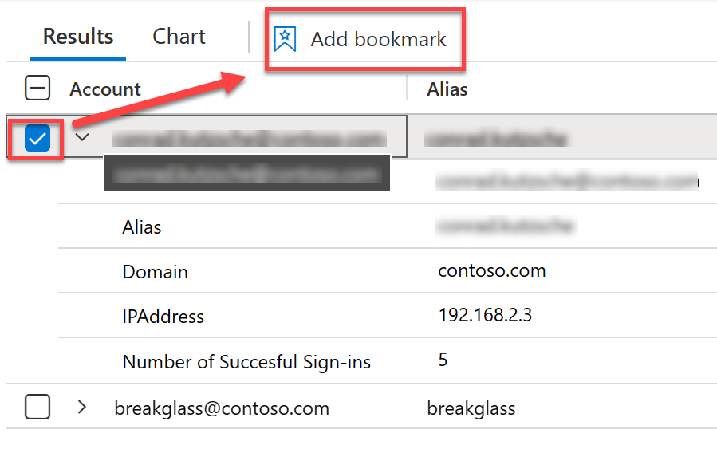

## LAB 03 - Explore Logs using KQL

All logs within Microsoft Sentinel are queried and accessed using Kusto Query Language, whether that is via a workbook, GUI, API or directly. In this exercise we will explore events within the logs and enrich and exisiting incident with book.
 
For the purpose of this demo, the table referenced is *"SigninLogs_CL"*, which is a simulated version of the built in table, *"SigninLogs"*

Before we explore the logs. We need to have a hypothesis in mind. At this initial stage, we want to ask the following question.


> What other data in the logs relate to the entities from our incident? <br>
We know that the Break Glass account has been signed in and we know the IP Address that it has signed in from. We also know that multiple other users have signed in, from various locations using workbooks. but at this stage we haven't identitfied what other users have signed in from the same IP Address.

## Task 1: Get the entities related to your incident.

Let us start with getting the entity information from before.

1. From within the Microsoft Sentinel blade, under Threat management, select **Incidents**.
<br><br>

2. Locate your open incident from before. ("*Demo: Contoso Break Glass Account Login | User XX*", where XX is the number assigned to you.)
<br><br>
> **Note:** If there are no incidents shown, ensure that you have assigned it to you and the incident status is "*New*" or "*Active*"

3. Take note of your Incident number, you will need this later.

4. Select your incident then click **View full details** 
<br><br>

5. Click the **Entities** tab and take a note of the entities, you will need this in the next task. In this example there should be an account and an IPv4 Address
<br><br>

6. Navigate back to the Microsoft Sentinel Incidents by selecting the **X** in the upper right hand corner.

## Task 2: Getting started with Search

Because we do not know where this data relating to the IP Address could be, we need to ask the question.

> Where and what data is within Microsoft Sentinel that has Incident IP Address?

1. From within the Microsoft Sentinel blade, under Threat management, select **Logs**.
<br><br>

> **NOTE:** You may be presented to a *"Welcome to Logs Analytics"* page, followed by a Queries page. Both of these can be closed by selecting the *X* in the upper right hand corner of the windows. These can be accessed again using the Queries and Documentation Icon in the upper right hand corner of the Logs blade.

2. Within the query window type or paste the following:
```kusto
search "X.X.X.X" // Replace X.X.X.X with the IP Address from your entity
```


3. Now click **Run**. The [search](https://docs.microsoft.com/azure/data-explorer/kusto/query/searchoperator?pivots=azuremonitor) function will return all results within the last 24 hours with all logs across all tables where this IP address exists.

> **NOTE**: The next query can be run from within the same query window, just ensure you leave at least one blank line between queries.

4. We may not have any data within the last 24 hours, so change the query window Time Range to **Last 7 Days**
<br><br>

5. To find out a [distinct](https://docs.microsoft.com/en-us/azure/data-explorer/kusto/query/distinctoperator) list of tables which contain this IP address, type or paste:
```kusto
search "X.X.X.X" // Replace X.X.X.X with the IP Address from your entity
| distinct $table
```
> **Note:** Before we click run, ensure that only the current query is highlighted by clicking anywhere within the query (It will be highlighted grey via this method). Ensure you leave at least one blank line between queries if running within the same query windows
<br><br>

> Here we have performed the same query initial query "search X.X.X.X", but now passed the results over the pipe " | " to the next operator and that returns a distinct list of unique results using the column **$table**

6. Currently we are filtering using Time range within the UI, however we can add a Time Range filter within the query. Here we have added an inline filter using the [where](https://docs.microsoft.com/en-us/azure/data-explorer/kusto/query/whereoperator) command. Note that the Time range parameter automatically detects and reads *Set in query*. Type / paste the following query and click **Run**.

```kusto
search "X.X.X.X" // Replace X.X.X.X with the IP Address from your entity
| where TimeGenerated > ago(7d)
| distinct $table
```

7. Now lets amend the arguments of the search to return the results from one table. Type / paste and run the following query. You will see that all of the logs have this IP Address in at least one column.

 ```kusto
 search in (SigninLogs_CL) "X.X.X.X" // Replace X.X.X.X with the IP Address from your entity
| where TimeGenerated > ago(7d)
 ```

## Task 3: Understanding Tables, schemas and Data Types

Before you go any further, it is important to have a basic understanding of the structure within Log Analytics.

1. On the left-hand side of Log Analytics, click **Tables**.

2. In the search field, type **SecurityIncident** (Not case sensitive).

3. Click the arrow to the left of the table. You will see the list of columns in alphabetical order, and their data type.
4. Hover your cursor over the **SecurityIncident** table, and the in the window that appears, click **SecurityIncident**.
<br><br>

5. This will take you to the docs.microsoft.com page. Each built-in table should have a detailed description of the columns, though older tables may not be up to date. Click **Other Tables** to the left and view their schema and descriptions. Once done, return to the previous window / tab in the Azure Portal.

> **Note:** At the time of writing, not all tables have the descriptions populated.

6. Now return to the query pane, type or paste the following:
```kusto
print "Hello world"
```
In this example we have used the [print](https://docs.microsoft.com/en-us/azure/data-explorer/kusto/query/printoperator) operator to return the value "Hello world" to the automatically named column *print_0*.


7. To name the column, simply add an alias to the left side of the " = " operator.
```kusto
print Message = "Hello world"
```

8. On the next new line, immediately after the previous (no line spacing) type the pipe symbol " | ", then a space. Intellisense should start automatically and start suggesting possible values for this position in the query. 
> **NOTE:** If Intellisense has not started, or you have clicked / typed somewhere else, just click **CTRL+SPACE** simultaneously on your keyboard.
 
9. For some operators, like *where* you can select an arrow which will display the information for this operator from docs.microsoft.com. 
<br><br>

10. Continue completing the query by selecting the **where** and your named column called **Message**. Now intellisense should show a list of evaluation operators relevant to the string data type. Choose **startswith** then type "h".

```kusto
print Message = "Hello world"
| where Message startswith "h"
``` 
11. As *startswith* is a case-insensitive operator, it will evaluate the first character "h" and "H" as the same, and therefore return the result. Experiment with other operators and review the documentation to understand how to use all these operators. https://docs.microsoft.com/en-us/azure/data-explorer/kusto/query/datatypes-string-operators#operators-on-strings

12. The previous example was with the string data type. You will find that numerical data types ([int](https://docs.microsoft.com/en-us/azure/data-explorer/kusto/query/scalar-data-types/int), [long](https://docs.microsoft.com/en-us/azure/data-explorer/kusto/query/scalar-data-types/long) [real](https://docs.microsoft.com/en-us/azure/data-explorer/kusto/query/scalar-data-types/real), [decimal](https://docs.microsoft.com/en-us/azure/data-explorer/kusto/query/scalar-data-types/decimal)) and [datetime](https://docs.microsoft.com/en-us/azure/data-explorer/kusto/query/scalar-data-types/datetime) types have the same operators as each other, but different to strings. In the query window, type:

```kusto
print Number = 123
| where Number
```
Here you can see the evaluation operators include between (for a value inside a range) and greater than " > " / less than symbols  " < ". Compare these to another numerical or date time value

``` powershell
print Number = 123
| where Number > 100
```

13. The easiest way to perform actions against  datetime types, is comparing them against a timespan value. In this example, we are doing a few things.
    1. Creating a Tabular statement with the column called **TimeGenerated**
    2. Getting the datetime of right now using [**now()**](https://docs.microsoft.com/en-us/azure/data-explorer/kusto/query/nowfunction).
    3. Then using a timespan value and arithmetic operator, going backwards by one day using **-1d**.
    4. Using the **Where** operator, we are ensuring the data is from within the last seven days, but this time using the [**ago()**](https://docs.microsoft.com/en-us/azure/data-explorer/kusto/query/agofunction) function, with a timespan operator

>**NOTE:** Both **now(-1d)** and **ago(1d)** will produce the same results.

```kusto
print TimeGenerated = now(-1d)
| where TimeGenerated > ago(7d)
```
14. For dynamic types, these are JSON object (or arrays) that have a nested data structure. For this example, type/paste and then run:

```kusto
SigninLogs_CL
| take 100
```
>**Note:** You may need to change the Time range to reflect when the custom data was ingested.
15. Select the arrow to the left of the first result, scroll down to **LocationDetails** and right-click **city**, then click **Include "<City>"**. This will add a **where** statement to the nested JSON. Once done, click **Run**
<br><br>

## Task 4: Building our query

So far you have looked at searching for data, and different data types. We have identified that this IP address can be found in the SigninLogs_CL table. Now lets build a query to answer the following question.

> Where else has had successful sign in events occurred that are related to the incident IP address entity within the last 7 days?

> **NOTE:** Each step will build upon the last query, unless otherwise specified.

1. Looking in the Sign-in Logs, scope the results for just the last 7 days.

```kusto
SigninLogs_CL
| where TimeGenerated > ago(7d)
```

2. Now add another filter to focus just on successful events. 

```kusto
SigninLogs_CL
| where TimeGenerated > ago(7d)
| where ResultType == 0
```
> **NOTE:** This query gives the *where operators separated by a pipe is the same as:
> ```kusto
SigninLogs_CL
> | where TimeGenerated > ago(7d) and ResultType == 0
> ```

3. Now we want to see the number of successful sign-ins by IPAddress, though it would still be usefull to see other columns as well. We can achieve this using the query language and the UI. 

```kusto
SigninLogs_CL
| where TimeGenerated > ago(7d)
| where ResultType == 0
| summarize count() by UserPrincipalName, IPAddress
```
This example calls the [summarize](https://docs.microsoft.com/en-us/azure/data-explorer/kusto/query/summarizeoperator) operator. This produces a table that aggregates the output. 

Here we are using the [count()](https://docs.microsoft.com/en-us/azure/data-explorer/kusto/query/count-aggfunction) aggregation function which counts the number of records per summarization group.

Because we have **by** next, this is declaring the summarization groups, in this example they are the columns **UserPrincipalName** and **IP Address**.This will produce a numerical value for each unique combination of the two values.

4. Now click the column called count_. This will reorder the results.
<br><br>

5. Click **Columns** on the far right hand side. Click and hold the double vertical ellipses for IPAddress and drag it down to **Row Groups** and count_ to **Values**.
<br><br>

6. Now we wanted to focus on just one IP address, so add the following where into the statement

```kusto
SigninLogs_CL
| where TimeGenerated > ago(7d)
| where ResultType == 0
| where IPAddress == "X.X.X.X" // Replace X.X.X.X with the IP Address from your entity
| summarize count() by UserPrincipalName, IPAddress
```

7. By now you should be able to identify all the users related to the IP Address. Now lets tidy the results up. First lets split the UserPrincipalName up into the alias and domain using the [**extend**](https://docs.microsoft.com/en-us/azure/data-explorer/kusto/query/extendoperator) operator and [**split**](https://docs.microsoft.com/en-us/azure/data-explorer/kusto/query/splitfunction) function.

```kusto
SigninLogs_CL
| where TimeGenerated > ago(7d)
| where ResultType == 0
| where IPAddress == "X.X.X.X" // Replace X.X.X.X with the IP Address from your entity
| summarize count() by UserPrincipalName, IPAddress
| extend SplitUPN = split(UserPrincipalName, "@")
```

8. Now lets put the values into their own columns. Note the **extend** is split over two lines. Also we are casting the data from the split to the string data type (from dynamic).

```kusto
SigninLogs_CL
| where TimeGenerated > ago(7d)
| where ResultType == 0
| where IPAddress == "X.X.X.X" // Replace X.X.X.X with the IP Address from your entity
| summarize count() by UserPrincipalName, IPAddress
| extend SplitUPN = split(UserPrincipalName, "@")
| extend Alias = tostring(SplitUPN[0]),
    Domain = tostring(SplitUPN[1])
```

9. Now return only the results we want and tidy the column names up using the [project](https://docs.microsoft.com/en-us/azure/data-explorer/kusto/query/projectoperator) operator.

```kusto
SigninLogs_CL
| where TimeGenerated > ago(7d)
| where ResultType == 0
| where IPAddress == "X.X.X.X" // Replace X.X.X.X with the IP Address from your entity
| summarize count() by UserPrincipalName, IPAddress
| extend SplitUPN = split(UserPrincipalName, "@")
| extend Alias = tostring(SplitUPN[0]),
    Domain = tostring(SplitUPN[1])
| project Account = UserPrincipalName, Alias, Domain, IPAddress, ['Number of Succesful Sign-ins'] = count_
```
## Task 5: Bookmark and Investigate

Within Log Analytics, through the context of Microsoft Sentinel, you can bookmark results and add them to new or existing Incidents. You can now bookmark the results of the last query and add it to your incident.

1. Within Log Analytics, run the following query:

```kusto
SigninLogs_CL
| where TimeGenerated > ago(7d)
| where ResultType == 0
| where IPAddress == "X.X.X.X" // Replace X.X.X.X with the IP Address from your entity
| summarize count() by UserPrincipalName, IPAddress
| extend SplitUPN = split(UserPrincipalName, "@")
| extend Alias = tostring(SplitUPN[0]),
    Domain = tostring(SplitUPN[1])
| project Account = UserPrincipalName, Alias, Domain, IPAddress, ['Number of Succesful Sign-ins'] = count_
```

2. Select the checkbox to the left of the record(s) you wish to add and click **Add bookmark**.
<br><br>
>**Note:** It is possible to select multiple rows at once and populate each created bookmark with the same information.

3. Change the **Bookmark Name** to *"Break Glass Investigation User XX"* (where “XX” is the number you have been assigned at the start of class). 

4. Change the Entity mapping for the account and IP address (Click **Add new entity** to add more entities):
    | Entity type | Identifier | Value |
    | - | - | - |
    | Account | FullName | Account |
    | IP | Address | IPAddress | 

5. Add **Notes** commenting on your investigation. For example *"Successful sign-ins related to IP X.X.X.X"* 

6. Click *Create*

7. Navigate back to the Microsoft Sentinel Menu, click **Hunting**.
<br><br>
> **Note:** If a message appears about saving your query, it is safe to dismiss.

8. Select the **Bookmarks** tab, then select your bookmark. On the far right of the result (you may need to scroll right), select the ellipses " **...** " and click **Add to existing incident**.

9. In the search field, type in your Incident ID number. Alternatively search by your UserId or OwnerId.

10. Select your incident once found and click **Add**
<br><br>

11. You will now see in the Bookmarks tab that your bookmark now has a Severity and Incident name.

12. Click the **Investigate** button. You can now see your bookmark added to the investigation and linked to the incident in the graph via the IP Address entity.
<br><br>
> **NOTE:** The entities may take a few seconds to appear. Exit the investigation and enter again once the entities can be seen on the Hunting bookmark.

> **Reminder:** Do not forget to update your tasks! 😀

### Continue with the next lab

<a href="../LAB04/README.MD" target="_blank">LAB 04 - Respond to Incident</a>
