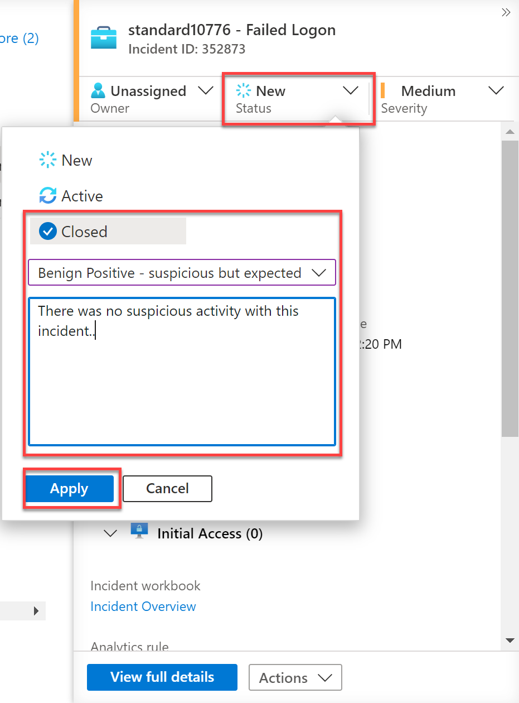
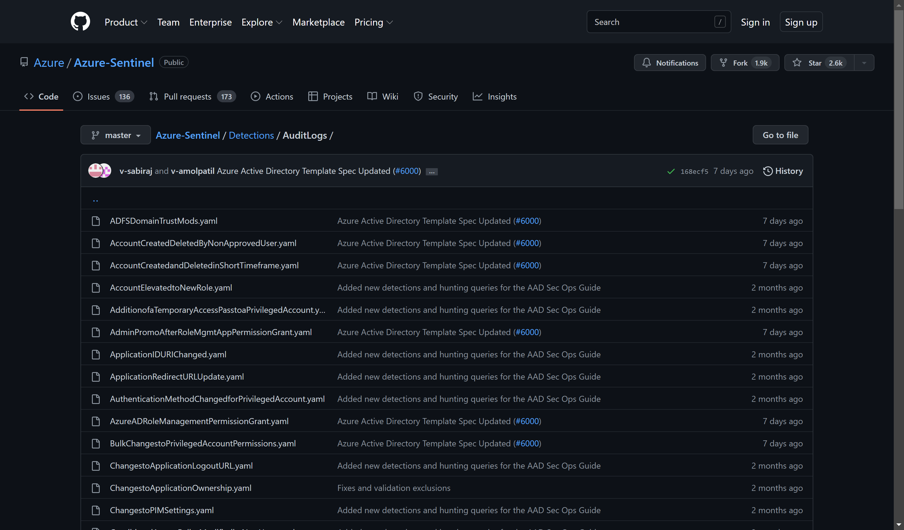
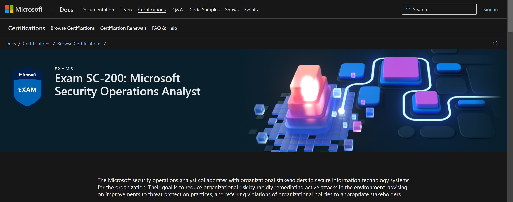

## LAB 04 - Close Incidents and Community

Once an investigation into an incident has completed and the issue is resolved, the incident requires closing. This is a relatively simple task and sometimes forgotten. Closing incidents aids SOC analytics and built-in machine learning which provides tuning recommendations.

## Task 1: Close your Incident

1. From within the Microsoft Sentinel blade, under Threat management, select **Incidents**.

  

2. Locate your incident *standard**XX** – Failed Logon* (where “XX” is the number you have been assigned at the start of class).

3. Click on your incident, then review the details in the right hand pane.

4. In the details pane, change the status to **Closed**. This will bring up further fields.

5. Change the drop down **Select classification** to one of the following:
 - True Positive - suspicious activity
 - Benign Positive - suspicious but expected
 - False Positive - incorrect alert logic
 - False Positive - incorrect data
 - Undetermined

6. Add a comment regarding the closure reason.

7. Click **Apply**.

  

## Task 2: Review Community Content.

1. Within your internet browser, navigate to https://techcommunity.microsoft.com/t5/microsoft-sentinel-blog/become-a-microsoft-sentinel-ninja-the-complete-level-400/ba-p/1246310

> **Note:** This also can be found by searching for Sentinel Ninja Training.

2. This site contains the extensive list of training materials for Microsoft Sentinel. It is worth going through this site and pick out key trainings for your role.

  

3. Within your internet browser, navigate to https://github.com/Azure/Azure-Sentinel 

> **Note:** This also can be found by searching for Sentinel GitHub Community

4. This repository contains out of the box detections, exploration queries, hunting queries, workbooks, playbooks and much more to help you get ramped up with Microsoft Sentinel and provide you security content to secure your environment and hunt for threats. Here you can find contributions from the wider community for reuse.

  

5. Within your internet browser, navigate to https://docs.microsoft.com/en-us/certifications/exams/sc-200 

> **Note:** This also can be found by searching for SC-200.

6. This will take you to the Microsoft Exam SC-200: Microsoft Security Operations Analyst certification page. Here you can find details of the the exam, as well as learning paths for the exam

  

### Thank you 

Thank you for taking the time completing this lab. There is much more to Microsoft Sentinel with regards to tools and capabilities. Please take the time to do further learning and utilize the tools to make your organisation more secure and detect threats with ease.