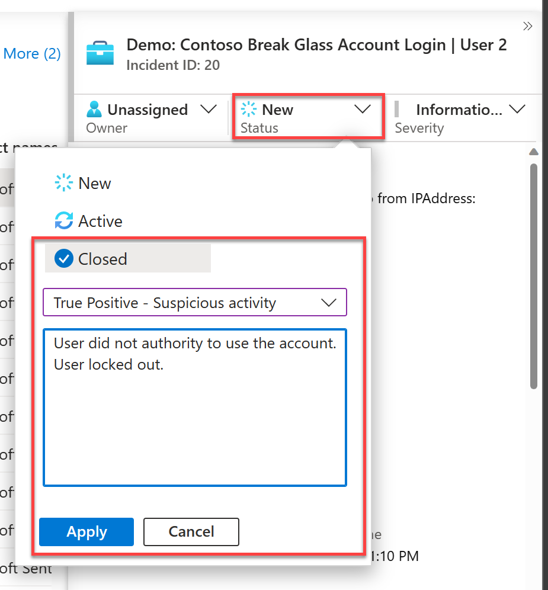

## LAB 04 - Respond to Incidents

By now, we should of been able to go through all the logs and gather enough information to move the investigation on to the next stage. Typically an incident most likely involves looking at multiple data sets. For our example we have identified the only other user logged in from an IP address, but we would typically investigate events on the device (if managed by your organisation) and any other logs incoming and out going to that IP address. 

For this lab, the investigation is over, we want to respond by locking out the suspect user account. Historically, this would invole other teams having to perform actions, but we have automation set up and approved for use within your organisation to do the actions for us. 

Once this has been completed successfully, the incident requires closing. This is a relatively simple task and sometimes forgotten. Closing incidents aids SOC analytics and built-in machine learning which provides tuning recommendations to help you improve your responses in future.

## Task 1: Run the playbook

1. From within the Microsoft Sentinel blade, under Threat management, select **Incidents**.
  

2. Locate your open incident from before. ("*Demo: Contoso Break Glass Account Login | User XX*", where XX is the number assigned to you.). Once found click **Full Details**
  
> **Note:** If there are no incidents shown, ensure that you have assigned it to you and the incident status is "*New*" or "*Active*"

3. There are multiple types of Playbook triggers (Alert, Incident and Entity). For this example, we are manually running a playbook with an entity trigger. Select the suspect account within the overview page, select the ellipses "..." (or right-click), then select **"Run playbook"**.
  

4. Playbooks listed here are ones that you have permissions to run and have the entity trigger. Find the *Demo-Disable_User_Account* playbook, the click **Run**
  

5. As this is a simple playbook that does not perform any actions other than adding comments, it should run quickly. Navigate back to your incident and select **Activity Log**. You should see that a new comment has been added detailing the output of the automation. Playbooks are fully customizable by your organization to meet your needs, with 100's of prebuilt connectors to Microsoft and third party services.

## Task 2: Close your Incident

1. From within the Microsoft Sentinel blade, under Threat management, select **Incidents**.
    

2. Locate and select your open incident from before. ("*Demo: Contoso Break Glass Account Login | User XX*", where XX is the number assigned to you.). 

3. In the details pane, change the status to **Closed**. This will bring up further fields.

5. Change the drop down **Select classification** to one of the following:
 - True Positive - Suspicious activity
 - Benign Positive - Suspicious but expected
 - False Positive - Incorrect alert logic
 - False Positive - Incorrect data
 - Undetermined

6. Add a comment regarding the closure reason.

7. Click **Apply**.
  

## Task 3: Review Community Content.

1. Within your internet browser, navigate to https://techcommunity.microsoft.com/t5/microsoft-sentinel-blog/become-a-microsoft-sentinel-ninja-the-complete-level-400/ba-p/1246310

> **Note:** This also can be found by searching for Sentinel Ninja Training.

2. This site contains the extensive list of training materials for Microsoft Sentinel. It is worth going through this site and picking out key trainings for your role.
  

3. Within your internet browser, navigate to https://github.com/Azure/Azure-Sentinel 

> **Note:** This also can be found by searching for Sentinel GitHub Community

4. This repository contains out of the box detections, exploration queries, hunting queries, workbooks, playbooks and much more to help you get ramped up with Microsoft Sentinel and provide you security content to secure your environment and hunt for threats. Here you can find contributions from the wider community for reuse.
  

5. Within your internet browser, navigate to https://docs.microsoft.com/en-us/certifications/exams/sc-200 

> **Note:** This also can be found by searching for SC-200.

6. This will take you to the Microsoft Exam SC-200: Microsoft Security Operations Analyst certification page. Here you can find details of the the exam, as well as learning paths for the exam
  

# Thank you 

Thank you for taking the time completing this lab. This lab gives you an insight to using Sentinel from an Analyst perspective. There is much more to Microsoft Sentinel with regards to tools and capabilities, including powerful machine learning tools, insights and out of the box solutions. Please take the time to do further learning and utilize the tools to make your organisation more secure and detect threats with ease.
