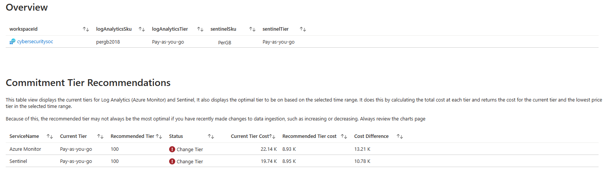
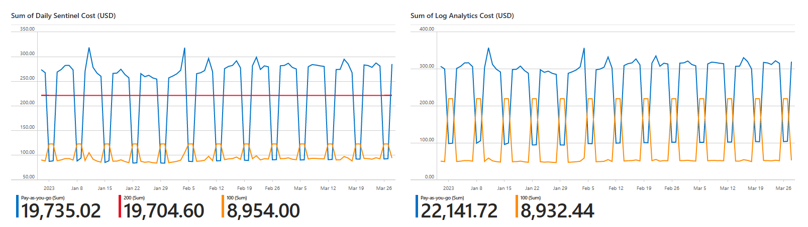
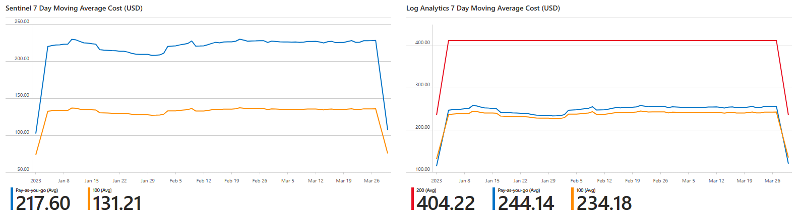
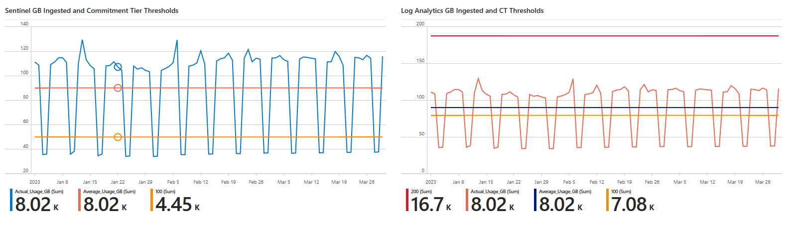
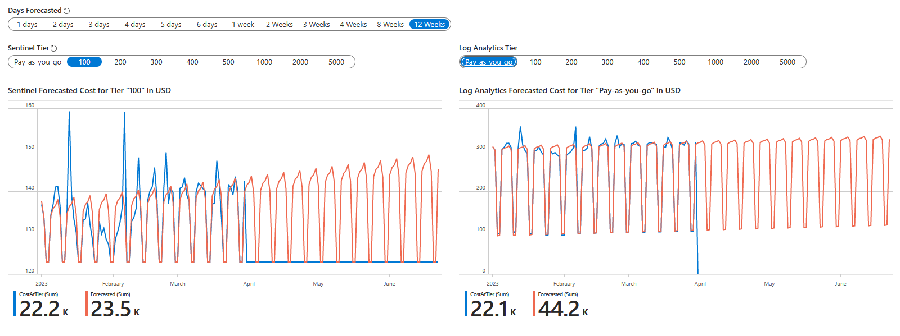

# Commitment Tier Workbook

This workbook has been desgined to help not only provide recommendations into changing Log Analytics and Sentinel Commitment Tiers, but help understand the thresholds and ingestion trends over time using the retail price for your selected region and currency.

This workbook does not account for historical prices, such as flucutations to exchange rates / base rate changes, though the back end script does collect this data. It is not to be used as an exact cost, as it does not reflect any discounts you may receive.

## Contents
- [Workbook Parameters](#workbook-parameters)
- [Overview Tab](#overview-tab)
- [Charts Tab](#charts-tab)
    - [Chart Parameters](#chart-parameters)
    - [Sum of Daily Costs](#sum-of-daily-costs)
    - [Seven Day Moving Average](#seven-day-moving-average)
    - [GB Ingested and Thresholds](#gb-ingested-and-thresholds)
- [Forecasting Tab](#forecasting-tab)
    - [Forecasting Parameters](#forecasting-parameters)
    - [Forecasting Charts](#forecasting-charts)

## Workbook Parameters

### Displayed
- **Time Range**: This should be set to at least 7 days minimum. You can select custom time ranges, but note that data shown will only show complete days, for example if you pick the last 14 days, data show will start at the beginning of the first complete day and end of the last complete day.
- **Subscriptions**: Azure subscription picker
- **Workspace**: The Log Analytics workspace you want to review. If the workspace isn't Sentinel enabled, then Sentinel charts won't load
- **Currency Code**: You must select manually the currency code you are billed in.
- **Show Help**: This displays further information within the workbook to assist. 
- **Use Demo Data**: When displaying value for the workbook or simulating tier changes, changing this to *Yes* allows for you to visualise what the workbook would look like if breaching the 100 GB Commitment tier.

### Hidden
- If you clone this repo and wish to host it in a differenct Github repository, the hidden parameter **RepositoryURL** can be changed to direct the queries to another. The directory structure is also included in this URL up to and including the directory that containers the *Sentinel* and *Azure Monitor* directories. The default is *https://raw.githubusercontent.com/TheAlistairRoss/MicrosoftSentinel/main/Solutions/CostManagement/Prices*

## Overview Tab

This tab shows you the current sku and tier for Log Analytics and Sentinel for the selected workspace.

It also provides you simple recommendations and estimated cost savings

## Charts Tab

The charts tab is aimed at understanding the cost of ingestion. All the charts are colour coded for each tier. Sentinel charts are shown on the left with Log Analytics on the right.

### Chart Parameters

Because the Sentinel and Log Analytics Commitment Tiers become cost effective at different levels of ingestion, you can select the different tiers by selecting the values in the parameters *Sentinel Commitment Tier* and *Log Analytics Commitment Tier*

### Sum of Daily Costs

These charts show the retail cost for Sentinel (left) and Log Analytics (Right) based on the selected commitment tiers and current usage.

For example if you change the parameter **Sentinel Commitment Tier** to *Pay-as-you-go* and *500*, the left chart would display two series for each selected tier. Each series would reflect the retail prices that would have been paid based on the selected tiers.

When trying to interpret these costs , the legend shows the total cost for the selected time range, with the most expensive tier on the left and the best value on the right.

### Seven Day Moving Average

These charts show the moving average costs for Sentinel (left) and Log Analytics (Right) based on the selected commitment tiers and current usage.

In statistics, a moving average is a calculation to analyze data points by creating a series of averages of different subsets of the full data set. This is used in this example to smooth out short term fluctuations in the data and to highlight weekly trends

For example if you change the parameter **Sentinel Commitment Tier** to *Pay-as-you-go* and *500*, the left chart would display two series for each selected tier. Each series would reflect the moving averages cost based on the selected tiers.

### GB Ingested and Thresholds

These charts show the actual and average ingestion of billable data for Sentinel (left) and Log Analytics (right). It also visualises the thresholds which the selected commitment tiers become cost effective. 

For example if you change the parameter **Sentinel Commitment Tier** to *Pay-as-you-go* and *500*, the left chart would display two series for each selected tier. It would also display two series called *"Actual_Usage_GB"* and *"Average_Usage_GB"*

If the Actual_Usage_GB and / or Average_Usage_GB is higher than a displayed commitment tier, then it would be highly likely that moving to the next tier would be cost effective.

## Forecasting Tab

These charts show the current ingestion cost the forecasted ingestion costs based of billable data for Sentinel (left) and Log Analytics (right). It also visualises the thresholds which the selected commitment tiers become cost effective. 

### Forecasting Parameters
- **Time Range**: ensure the workbook Time Range parameter is set to either the maximum time range based on your retention, or to the point in time you last made significant data ingestion changes (For example if you have onboarded new data sources in the last month)
- **Days Forecasted**: This is how far in the future you want to forecast. The further from the Time Range end time, the less accurate the prediction. Also if you have a smaller data set or had major data changes, the less accuratte.
- **Sentinel Tier**: This chart can only display one tier at a time. Select the Sentinel tier your wish to simulate
- **Log Analytics Tier**: This chart can only display one tier at a time. Select the Log Analytics tier your wish to simulate

### Forecasting Charts

When observing these charts, you will see two series. 
- **CostAtTier**: This represents the current cost based on the pricing unputs and current usage. At the end of the selected time range, it will drop to 0.
- **Forecasted**: This reflects the trend of data, with anomalous data samples removed. This is why it does not match the *CostAtTier* series exactly. At the end of the selected time range, it will continue further for the number of days selected in the parameter **Days Forecasted**, providing a calculated prection of the data based on historcal data.

>Note: Forecasting cannot predict for unexpected changes that have not happened regularlly in the historical data, such as onboarding of new data sources. Also if seasonality cannot be detected (This means regular patterns, such as peaks and troughs in the data relating to user working hours), then it will display a line of best fit.

## Troubleshooting

This tab is aimed at ensuring that the data from the repository is loading. The URL is populated using the Service Name (Sentinel or Azure Monitor), the Currency Code and the ARM region name. 
The data for both services stored in the repository will be displayed, including historical prices from the time the script was published. 

If there are any pricing discrepencies, review the most recent retail costs and compare them against the official pricing pages
- Sentinel: [https://azure.microsoft.com/en-ca/pricing/details/microsoft-sentinel/](https://azure.microsoft.com/en-ca/pricing/details/microsoft-sentinel/)
- Azure Monitor: [https://azure.microsoft.com/en-gb/pricing/details/monitor/](https://azure.microsoft.com/en-gb/pricing/details/monitor/)